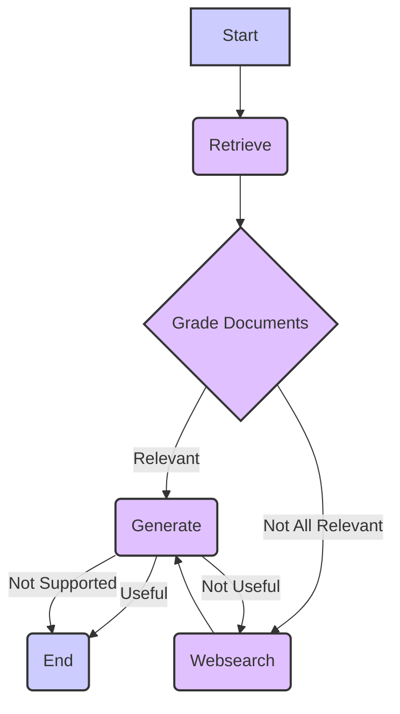

# Intelligent Question-Answering System with LangGraph

This project implements a powerful question-answering system using LangGraph, a library for building stateful, multi-actor applications with Large Language Models (LLMs). The system retrieves information from a document database and, if necessary, supplements it with web searches to provide accurate and comprehensive answers to user queries.

## How it Works

The system operates as a graph-based workflow, visually represented below:


### Workflow Breakdown

1.  **Start:** The process begins when a user submits a question.

2.  **Retrieve:**
    *   The system first attempts to find relevant documents from a pre-existing knowledge base (presumably stored in a vector database for efficient semantic searching).
    *   It extracts the user's question and uses it to query the knowledge base.
    *   The retrieved documents are then stored for further processing.

3.  **Grade Documents:**
    *   This is a critical step where the system assesses the relevance of each retrieved document.
    *   It uses a specialized "Document Grader Chain" (explained below) that leverages an LLM to determine if each document genuinely addresses the user's question.
    *   Irrelevant documents are filtered out.
    *   If *any* document is deemed irrelevant, a flag (`websearch`) is set to `true`, indicating the need for broader information gathering.

4.  **Websearch:**
    *   If the `websearch` flag is `true` (meaning the initial document retrieval was insufficient), the system performs a web search using the user's original question.
    *   This step uses a web search API to find potentially relevant web pages.
    *   The results from the web search are then processed (likely summarized or chunked) and added to the available information.

5.  **Generate:**
    *   This is where the system crafts an answer to the user's question.
    *   An LLM is prompted with the original question and the collected information (relevant documents and/or web search results).
    *   The LLM then generates a comprehensive response based on this context.
    *   If the answer is marked `useful`, the user gets it and the process ends.
    *   If the answer is marked `not useful`, the workflow goes back to `websearch` for gathering more information, then tries generating the answer again.
    *   If the answer is marked `not supported`, the user is informed that the system can't answer their question, and the process ends.

6.  **End:** The workflow terminates, delivering the generated answer (or a "not supported" message) to the user.

### Document Grader Chain: Ensuring Relevance

The Document Grader Chain is a key component responsible for ensuring that only truly relevant information is used to generate answers. Here's how it works:

*   **Purpose:** To evaluate the relevance of a document to the user's question.
*   **Input:**
    *   The original user question.
    *   A retrieved document.
*   **Process:**
    *   An LLM analyzes the document in the context of the question.
    *   The LLM is instructed to provide its assessment in a structured format (e.g., JSON). This is called "structured output."
    *   The structured output is then parsed into a Pydantic object, a data validation mechanism that helps ensure the output has the expected format.
    *   The Pydantic object will contain a boolean field indicating whether the document is relevant or not.
*   **Output:** A boolean value (`true` if relevant, `false` if not) for each document.

### Setup and Environment Variables

Before running the application, you need to set up the necessary environment variables. These variables are typically API keys, database credentials, and other sensitive information required for the system to function correctly.

1.  Run the `setup.sh` script provided in the project.
2.  Follow the on-screen prompts to enter the required values for each environment variable.

**Typical environment variables might include:**

*   **Web Search API Key:** Your API key for a web search service (e.g., Google Custom Search, Bing, etc.).
*   **LLM API Key:** Your API key for the Large Language Model being used (e.g., OpenAI, Anthropic, etc.).
*   **Vector Database Credentials:** Connection details for your vector database (if applicable).

### Benefits of Using LangGraph

*   **Stateful Workflows:** LangGraph allows the system to maintain state throughout the process, making it possible to remember past interactions and decisions.
*   **Cyclic Flows:** The ability to loop back (e.g., from `generate` to `websearch`) enables iterative refinement of the answer.
*   **Multi-Actor Capabilities:** LangGraph supports building complex systems with multiple interacting components (although this example primarily focuses on a single workflow).
*   **Flexibility:** The graph-based approach makes it easier to modify and extend the system's behavior.

### Conclusion

This project demonstrates a robust and intelligent question-answering system built using the power of LangGraph and Large Language Models. The combination of document retrieval, web searching, and a rigorous relevance-checking mechanism ensures that users receive high-quality answers to their queries. The system's modular and flexible design makes it a great foundation for building even more sophisticated knowledge-based applications.
```